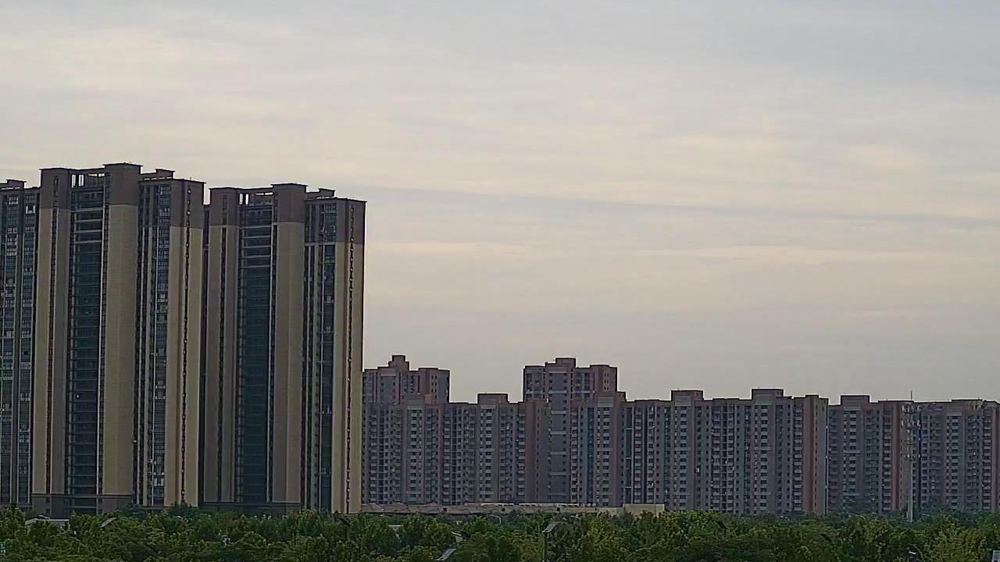
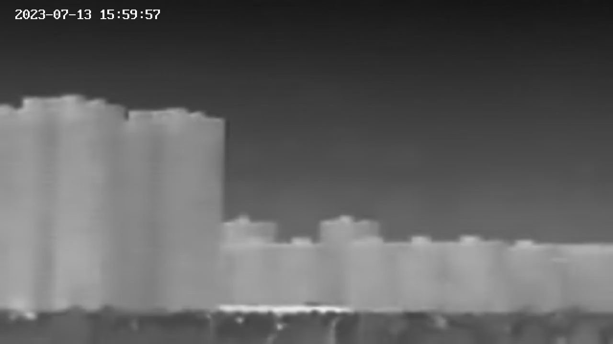

# RGB-FIR-dataset

**Introduction** 

This dataset contains air pollution monitoring images from areas surrounding Nantong University in Jiangsu Province. The dataset consists of three components: RGB visible light images, FIR (Far Infrared) images, and corresponding annotation files (combined_labels.csv).

**Data Scale and Specifications**

- The test dataset contains 1300 pairs of registered RGB-FIR image pairs
- Image resolution is uniformly set to 1280×720 pixels
- All images have undergone rigorous spatial registration to ensure precise correspondence between RGB and FIR images

Example

**Collection Details** 

Data collection spans multiple dates, with acquisition periods from 6:00 to 18:00 daily, covering observations under various lighting conditions and weather scenarios throughout the day.

**Data Access**

 The complete dataset has been uploaded to the Google Drive platform and is available for download via the provided link.https://drive.google.com/file/d/1A-z_6rOSPfIfp6-jjsoDpbaJ3tIe0YuZ/view?usp=drive_link

Agreement

In order to help us retain the appropriate rights and to regulate your use, we have created a dataset usage agreement.

If you want to use these dataset, please do contact us.

x2507537309@163.com    Starr Bruce